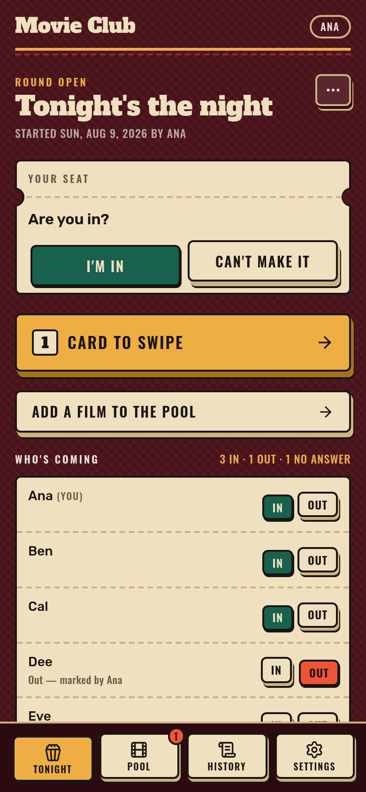
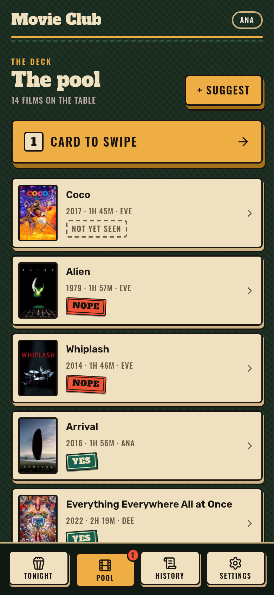
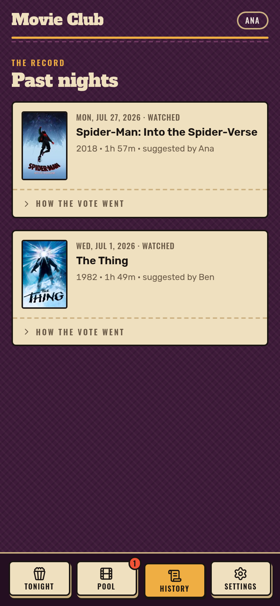
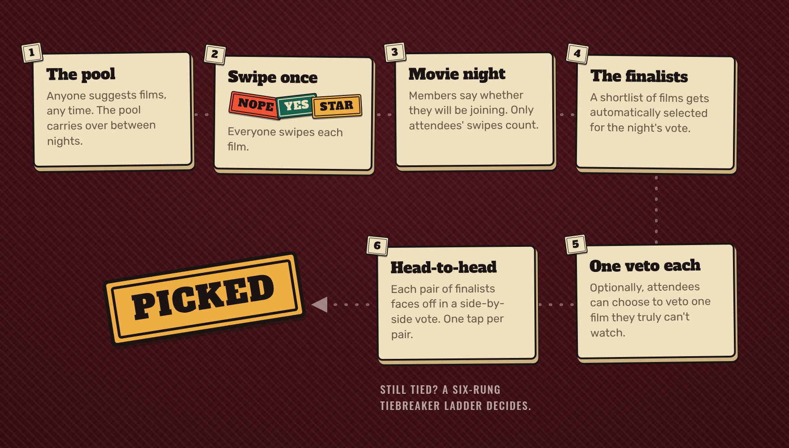

<p align="center">
  
</p>

A **definitely not** overengineered app for choosing what to watch on movie nights with friends.

Your group keeps a shared pool of films, and everyone swipes each film once: ❌/✔️/⭐. When you get together, the app turns those standing answers into a shortlist for
tonight's attendees, gives everyone one optional veto, runs a quick head-to-head runoff,
and reveals the winner. Thirty seconds of tapping instead of the usual thirty-minute debate.

**No accounts!** A group is a secret link you drop in the chat. Works on any browser and it's installable as a PWA.

<p align="center">
  
  
  
  
</p>

---

## How a film gets picked



The details the boxes leave out:

- **Swipes are permanent.** Answer a film once and you're done. Every future night reuses it,
  so a friend who never opens the app on the night still counts through what they already said.
- **The shortlist needs two things of a film**: enough of tonight's attendees have swiped it
  (*coverage*), and a high enough share of those swipes are yes (*approval*). Not having swiped
  is never counted as a "no".
- **Stars are seasoning, not votes.** They never move coverage or approval; they only break ties.
- **Vetoes block a film for the night, not forever.** A block lasts only as long as someone
  keeps spending their single veto on it, so grudges expire and real objections don't.
- **The diagram hides two shortcuts**: one runaway favourite skips the runoff entirely, and zero
  qualifying films ends in an honest "no clear favourite" instead of a forced pick.
- **Nothing ever falls to luck or insertion order** until the ladder says so:

| | Shortlist ties | Runoff cycles |
|---|---|---|
| 1 | yes-votes | Copeland score |
| 2 | stars | approval |
| 3 | approval | stars |
| 4 | rotation fairness | rotation fairness |
| 5 | shortest runtime | shortest runtime |
| 6 | random | random |

Each rung only separates what the rungs above left tied. *Rotation fairness* favours the attendee who has gone longest without a winning suggestion. And yes, stars and approval deliberately trade places between the two chains: at the shortlist boundary a star just reads the tied yes-count at finer grain, while in a runoff cycle a star only speaks once the live vote *and* standing approval have both refused to decide — seasoning never outranks consensus where it matters most.

The full rules — floors, cooldowns, edge cases, and the reasoning behind each — live in
[docs/voting-spec.md](docs/voting-spec.md); everything around the vote (groups, identity,
rounds, screens, data model) is in [docs/app-spec.md](docs/app-spec.md).

---

## Running it

### With Docker

Images are published to GHCR on every push to `main`:

```sh
docker run -d \
  --name movie-night \
  -p 3000:3000 \
  -v movie-night-data:/data \
  -e ORIGIN=https://movie-night.example \
  -e TMDB_API_KEY=your-tmdb-key \
  ghcr.io/rodrigohpalmeirim/movie-night:latest
```

- The container listens on **port 3000**.
- SQLite lives at `/data/movie-voting.db`. Mount `/data` on a volume or you lose the group when
  the container goes away.
- **Database migrations run at container start**, before the server, and are idempotent — so
  restarts and upgrades are cheap and there is no separate migrate step.
- **`ORIGIN` is required.** Without it (or `PROTOCOL_HEADER` + `HOST_HEADER` behind a reverse
  proxy) SvelteKit's CSRF check rejects every form POST with a 403. HTTPS is mandatory in
  production anyway, since the invite token travels in URLs.
- Behind nginx/Caddy: also set `ADDRESS_HEADER`, or both rate limiters collapse into one global
  bucket, and disable response buffering on the SSE route.

### Local development

```sh
bun install
cp .env.example .env      # then put a TMDB API key in it
bun run db:migrate        # creates ./data/movie-voting.db
bun run dev               # http://localhost:5173
```

A TMDB key is needed to suggest films at all — search and suggestion return 503 without one.
Everything else works fine.

Want a populated group in one command? The seed script builds a demo group at a fixed invite
token, with 5 members, 12 pool films, two finished nights and tonight's round already open:

```sh
DEV_MODE=1 bun run seed   # → http://localhost:5173/g/dev-movie-club
```

It refuses to run without `DEV_MODE=1` (or `--force`), because that token is guessable and the
token is the only credential the app has. Re-running wipes and recreates only that one group.
`DEV_MODE=1` also turns on the member switcher — a slim bar listing the group's members, where
tapping one re-points this browser at that member — so one browser can play all five people in
a round. Never set it in production.

### Environment variables

`.env.example` is the reference and documents the reasoning for each one; the short version:

| Variable | Default | Notes |
|---|---|---|
| `TMDB_API_KEY` | — | Required for movie search and suggestion. Server-side only. |
| `DATABASE_URL` | `./data/movie-voting.db` | SQLite file. `/data/movie-voting.db` in the image. |
| `ORIGIN` | — | Public origin. Required unless a proxy sets `PROTOCOL_HEADER`/`HOST_HEADER`. |
| `HOST` / `PORT` | `0.0.0.0` / `3000` | What the Bun server binds to. |
| `CERT_COUNTRY` | `PT` | Which country's age rating to display. |
| `IDLE_TIMEOUT` / `SSE_KEEPALIVE_MS` | `60` / `20000` | Must stay apart, or every tab's event stream reconnects in a loop. |
| `DEV_MODE` | unset | `1` enables the member switcher and unlocks the seed script. Development only. |

### Building

```sh
bun run build             # → ./build
bun run start             # serve the build
```

---

## Tests and checks

```sh
bun run check             # svelte-check: 826 files, 0 errors, 0 warnings
bun run test              # vitest — tally, cooldown, spec vectors (246 tests)
bun run test:server       # bun test src/lib/server — services and serialization (289 tests)
bun run test:all          # both
```

The fun one is [`spec-tests/`](spec-tests/README.md): 47 test vectors hand-derived from the
voting spec alone, by someone who never saw this code, with the arithmetic for every expected
value written out in the vector itself. They're an audit trail, not fixtures — they're never
edited to match the implementation, only re-derived when the spec text itself changes, and
twenty-one of them are built so a *plausible wrong* implementation produces a different
documented outcome rather than merely a different number. `spec-vectors.test.ts` is just an
adapter that runs them against the real tally module.

---

## Under the hood

| Layer | Choice |
|---|---|
| Framework | SvelteKit (Svelte 5, runes) |
| Runtime | Bun, via `svelte-adapter-bun` |
| Database | SQLite (`bun:sqlite`) with Drizzle ORM, WAL mode |
| Styling | Tailwind CSS v4 |
| Movie data | TMDB |

Some notes for the curious:

- **The tally module is pure.** `src/lib/tally/` touches no database, no framework and no
  clock: eligibility, coverage, approval, Condorcet, Copeland and both tiebreak chains are
  deterministic transforms of plain data, seeded from the round's stored `random_seed`.
- **Two vote lifetimes, never merged.** Standing swipes are permanent and have no round; vetoes
  and pairwise picks belong to exactly one round. That split is why adding a film never
  invalidates a vote and why no budget can ever lock up.
- **Everything is computed on read.** No derived counters, because derived counters drift.
- **Live-ness is SSE invalidation pings**, not websockets — the server never pushes data, only
  "something changed, refetch", which is also what keeps hidden tallies hidden.
- **One third-party origin.** Posters come from `image.tmdb.org`; fonts, scripts and styles are
  self-hosted, and the trailer is a plain link rather than an embed, so the invite token can't
  leak through a `Referer`.
- **Per-night effort is constant in pool size**: one optional veto tap plus at most ten pairwise
  taps, no matter how many films have piled up. There's a test for that.
